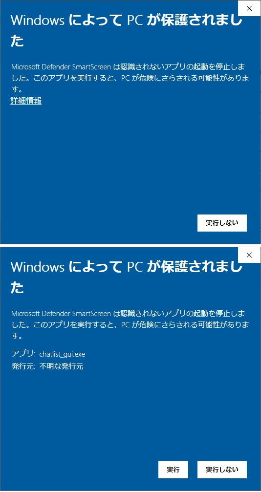
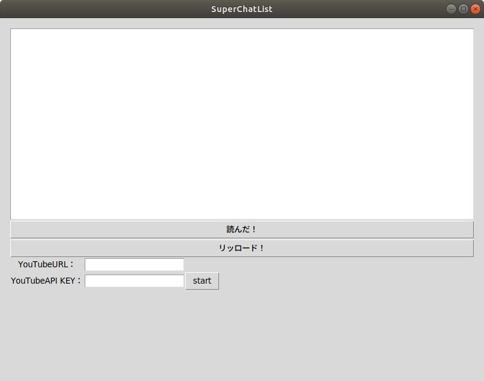
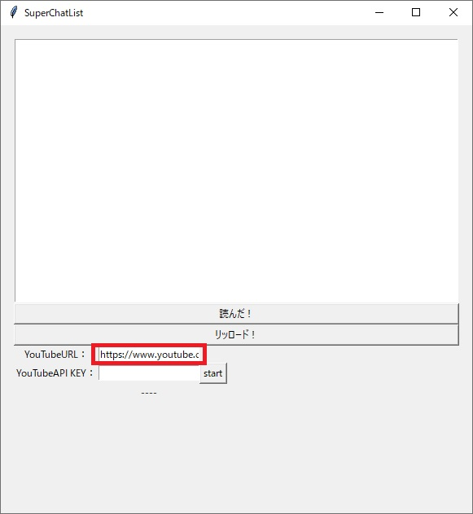
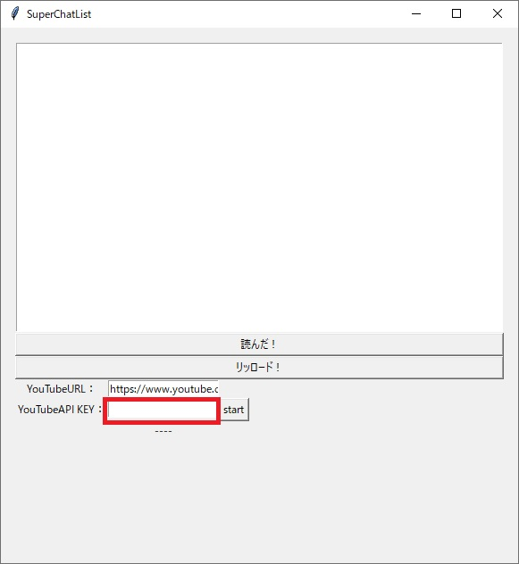
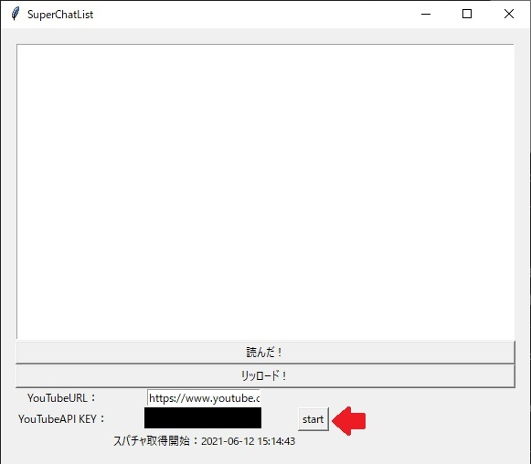
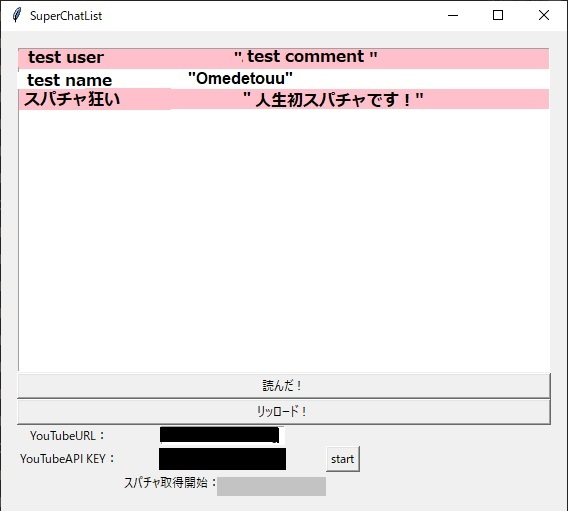
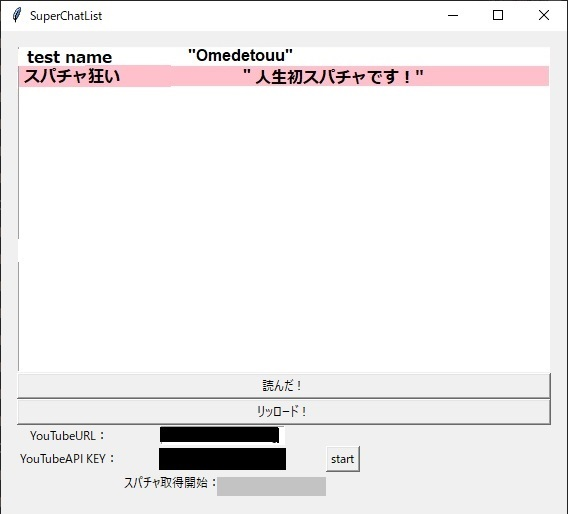
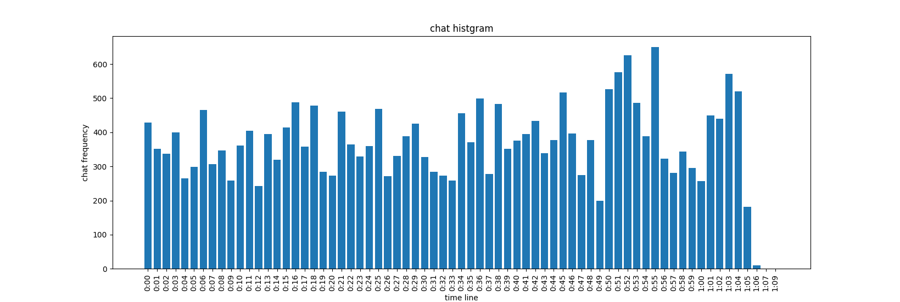

# SuperChatReader

+ Youtubeのスパチャを読み込んで一覧にするツール
+ ライブ配信中のチャットヒストグラム作成
  + チャットの盛り上がりの可視化

## ■事前準備

下記の準備をしてください。

### YouTubeのAPIKey取得

下記のリンクからYouTubeのAPIキーを取得してください。

※このキーは悪用されないように、誰にも秘密にして管理してください。

[YouTube API Keyの取得](https://qiita.com/iroiro_bot/items/1016a6a439dfb8d21eca)


## ■インストール

python3.6.9 >=

### Ubuntu

※特殊文字コード（絵文字）に未対応

```bash
$ sudo apt update
$ sudo apt install python3-dev python3-tk
$ sudo pip3 install -r requirements.txt
$ git clone https://github.com/wakaba130/SuperChatReader.git
```

### Windows(code)

+ [python install link](https://www.python.jp/install/windows/install.html)
+ [python setting](https://www.javadrive.jp/python/install/index3.html)

リンクの設定後、pipで関連ライブラリをインストールする。
コマンドプロンプトで以下を実行する。

```
$ sudo pip3 install -r requirements.txt
$ git clone https://github.com/wakaba130/SuperChatReader.git
```

## ■実行方法

## SuperChatReader GUI

スパチャ読みで使用しやすいGUIを作成しました。

### 実行方法

以下のコマンドを入力する


1. Releaseから `SuperChatReader.zip` をダウンロードします。
1. `SuperChatReader.zip`を解凍すると、`chatlist_gui.exe`があります
1. ダブルクリックすると実行され、以下のウィンドウが起動します。

※ネット接続するアプリケーションであるため、起動時にセキュリティソフトが反応する場合があります。
その場合、`詳細情報`をクリックすると、`実行`のボタンが出てきます。



実行時の画面です。



`YouTubeURL：`の欄にスーパーチャットを読み込む配信URLをコピペします。

YouTubeの `https://www.youtube.com/watch?v=XXXXXXXXXXX`という配信URLを入れてください。



`YouTubeAPI KEY：`の欄にYouTubeのAPIキーを入力します。



`start`：ボタンを押すと、スーパーチャットのログを取り始めます。

開始時間が表示されます。開始時間以前のスーパーチャットは読み込まれません。



`リッロード！`：ホタンを押すと、スーパーチャットの情報を上のリストに表示します。

並び順は、スーパーチャットを投げた時間になります。
リロードボタンを押すと更新がかかり、リストが更新されます。



`読んだ！`：ボタンを押すと、一番最初の欄の名前が削除されます。



## reader

配信準備中、配信中のスパチャログと通常チャットの投稿時間ログを保存する。

### 設定ファイルの準備

以下のconfig.yamlファイルを作成して、同じフォルダに保存する。
API_KEYの`XXXXXX`部分には、先程取得したAPIキーを書き込みます。
YouTubeURLは、Live配信のURLをコピペで貼ってください。

config.yaml

```yaml
API_KEY:     XXXXXXXXXXXXXXXXXXXXXXXX
YouTubeURL: https://www.youtube.com/watch?v=XXXXXXXXXX
sleep_time:  10 #sec
```

### 実行

```bash
$ cd SuperChatReader
$ python3 reader.py
```

## create_hist

チャットの投稿頻度を分単位で可視化する。
reader.pyで取得したログファイルを指定する。

```bash
$ python create_hist.py --logfile [text_XXXXXXXXXXX.log] --top 5
```

下図のように分単位のチャットの盛り上がりがわかります。



また、ターミナルには、`--top`で指定した上位のチャット時間が表示されます。

```
=== top 5 ===
('0:52', 812.0)
('0:22', 800.0)
('0:50', 774.0)
('0:27', 738.0)
('0:25', 730.0)
```

# ToDo

+ reader
  + 配信前予約機能
    + ライブ配信前の動画URLに対して、ずっとパラメータ取得を行っていると切断されるため
  + スパチャを見やすくする
  + 自分のスパチャのみハイライト表示
+ create_hist
  + 特になし

## できたらいいこと

+ 自動チェック
  + 特定の言葉(〜さん、ありがとう)が入った場合にリストを更新する。
+ ハイライト動画自動作成
  + チャットの盛り上がりから、ハイライト動画を作成