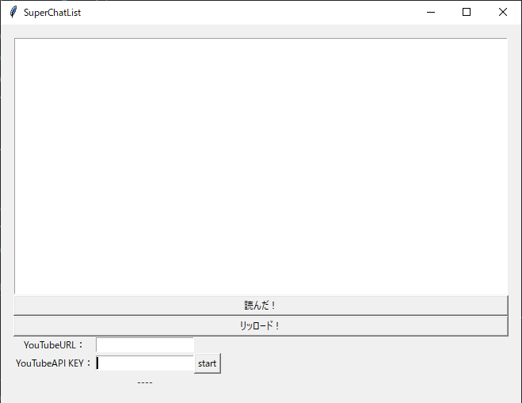

# SuperChatReader

+ Youtubeのスパチャを読み込んで一覧にするツール
+ ライブ配信中のチャットヒストグラム作成
  + チャットの盛り上がりの可視化

## ■事前準備

下記の準備をしてください。

### YouTubeのAPIKey取得

下記のリンクからYouTubeのAPIキーを取得してください。

※このキーは悪用されないように、誰にも秘密にして管理してください。

[YouTube API Keyの取得](https://qiita.com/iroiro_bot/items/1016a6a439dfb8d21eca)

## ■実行方法

## SuperChatReader GUI

スパチャ読みで使用しやすいGUIを作成しました。

### 実行方法

以下のコマンドを入力する

1. [Release](https://github.com/wakaba130/SuperChatReader/releases)から `chatlist_gui.zip` をダウンロードします。
1. `chatlist_gui.zip`を解凍すると、`chatlist_gui`のフォルダの中に`chatlist_gui.exe`があります。
1. ダブルクリックすると実行され、以下のウィンドウが起動します。

※ネット接続するアプリケーションであるため、起動時にセキュリティソフトが反応する場合があります。
その場合、`詳細情報`をクリックすると、`実行`のボタンが出てきます。

実行時の画面です。

`YouTubeURL：`の欄にスーパーチャットを読み込む配信URLをコピペします。

YouTubeの `https://www.youtube.com/watch?v=XXXXXXXXXXX`という配信URLを入れてください。

`YouTubeAPI KEY：`の欄にYouTubeのAPIキーを入力します。

`start`：ボタンを押すと、スーパーチャットのログを取り始めます。

開始時間が表示されます。開始時間以前のスーパーチャットは読み込まれません。

`リッロード！`：ホタンを押すと、スーパーチャットの情報を上のリストに表示します。

並び順は、スーパーチャットを投げた時間になります。
リロードボタンを押すと更新がかかり、リストが更新されます。

`読んだ！`：ボタンを押すと、一番最初の欄の名前が削除されます。

# 開発用のREADME

[開発中のプログラムの使用方法はこちら](test/DEVELOP.md)

# ToDo

+ reader
  + 配信前予約機能
    + ライブ配信前の動画URLに対して、ずっとパラメータ取得を行っていると切断されるため
  + スパチャを見やすくする（スパチャの色にするなど）
  + 自分のスパチャのみハイライト表示
+ create_hist
  + 特になし

## できたらいいこと

+ 自動チェック
  + 特定の言葉(〜さん、ありがとう)が入った場合にリストを更新する。
+ ハイライト動画自動作成
  + チャットの盛り上がりから、ハイライト動画を作成